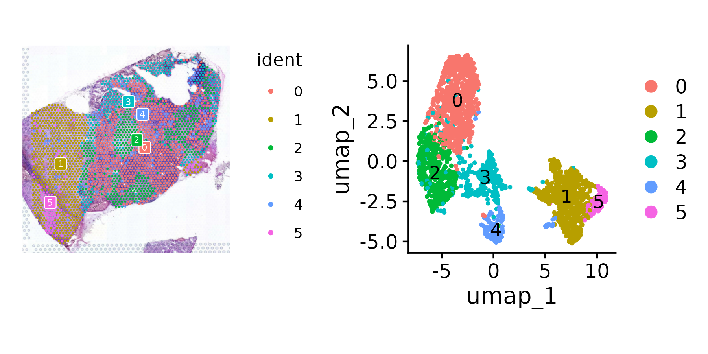

本次练习主要跟随 [空间转录组分析实战](https://blog.csdn.net/weixin_44359288/article/details/136514061) 系列教程，增加了一些注解，意在整理空间转录组可能会分析的项目。

注，由于偷懒没有QC，这一步请参考单细胞教程

## 01 数据

SpaceRanger 标准输，包括

```bash
GBM4_spaceranger_out
├── filtered_feature_bc_matrix    ## 这也是单细胞数据的目录
│   ├── barcodes.tsv.gz
│   ├── features.tsv.gz
│   └── matrix.mtx.gz
├── filtered_feature_bc_matrix.h5
├── molecule_info.h5
└── spatial
    ├── aligned_fiducials.jpg
    ├── detected_tissue_image.jpg
    ├── scalefactors_json.json
    ├── tissue_hires_image.png
    ├── tissue_lowres_image.png
    └── tissue_positions_list.csv
```

## 02 基本操作

参考 [Seurat](https://jiarong-l.github.io/notes/Bioinfo/Blocks/Seurat) 对 SeuratObj 进行预处理和聚类

**SpatialFeaturePlot()** 在原图上展示各Feature的表达量


**SpatialPlot()/SpatialDimPlot()** 在原图上展示聚类结果(do.hover交互)， **DimPlot()** 在降维空间展示聚类结果



另外，QC检测常用**VlnPlot()**，或者用pca检测数据整合状况   


## 03 空间区域

与单细胞不同，空间转录组的聚类不仅仅是为了定义细胞类型，更是为了定义功能区域。之后marker基因

通过对比HE染色片，或者对cell marker进行注释，可以给每个cell分配功能区域的标签。


查看marker的表达热图    


之后用clusterProfiler对Region的marker进行KEGG富集分析，操作与单细胞SeuratObj一致    


## 04 解卷积

10X in-situ 的分辨率还没有达到细胞级别，即每个spot中可能包含多个细胞。

利用单细胞转录组数据对spot进行解卷积是比较常见的作法，例如 [cell2location (Python)](https://cloud.tencent.com/developer/article/2376790)，[CARD (R)](https://github.com/YMa-lab/CARD)

前序: [Harmony](https://cloud.tencent.com/developer/article/2224243) 合并多个单细胞转录组数据 (目测效果似乎不好，可能是因为Unknown的关系？)


TBA


## Errors/Warning

* merge时的warning有关:```Warning: Some cell names are duplicated across objects provided. Renaming to enforce unique cell names.```
    - 结果是 ```TTTCCTCCACACAGAG``` 变成了 ```TTTCCTCCACACAGAG_i``` 

* [```Error in `.rowNamesDF<-`(x, value = value) : invalid 'row.names' length```](https://github.com/satijalab/seurat/issues/8916)
    - 看下```rownames(seurat_obj)```？
    - 可能是对 merge 后的数据进行 ```subset()```过滤引起的，因为有一个样本数据特别差：分别对样本 ```subset()```后发现此样本为空，报错
    - **建议各个数据集自己先filter，然后再merge**

* Harmony 需要知道cell的注释才能进行矫正（```group.by.vars```），否则会没有效果

