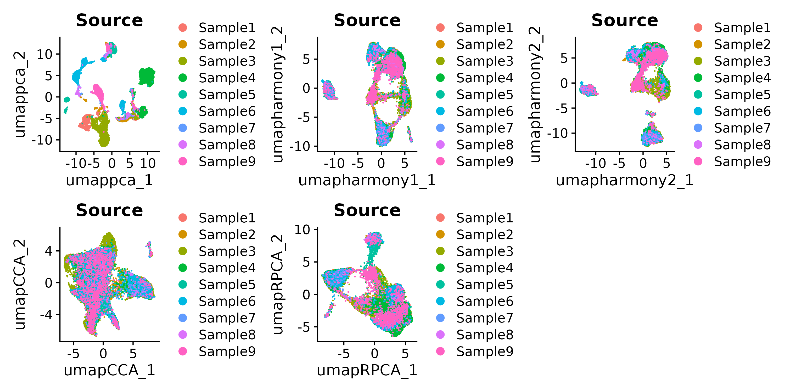

本次练习主要跟随 [空间转录组分析实战](https://blog.csdn.net/weixin_44359288/article/details/136514061) 系列教程，修正了一些代码错误，增加了一些注解/其它，意在整理空间转录组可能会分析的项目。

注，由于偷懒没有QC，这一步请参考单细胞教程

## 01 数据

SpaceRanger 标准输，包括

```bash
GBM4_spaceranger_out
├── filtered_feature_bc_matrix    ## 这也是单细胞数据的目录
│   ├── barcodes.tsv.gz
│   ├── features.tsv.gz
│   └── matrix.mtx.gz
├── filtered_feature_bc_matrix.h5
├── molecule_info.h5
└── spatial
    ├── aligned_fiducials.jpg
    ├── detected_tissue_image.jpg
    ├── scalefactors_json.json
    ├── tissue_hires_image.png
    ├── tissue_lowres_image.png
    └── tissue_positions_list.csv
```

## 02 基本操作

参考 [Seurat](https://jiarong-l.github.io/notes/Bioinfo/Blocks/Seurat) 对 SeuratObj 进行预处理和聚类

**SpatialFeaturePlot()** 在原图上展示各Feature的表达量


**SpatialPlot()/SpatialDimPlot()** 在原图上展示聚类结果(do.hover交互)， **DimPlot()** 在降维空间展示聚类结果


另外，QC检测常用**VlnPlot()**，或者用pca检测数据整合状况   


## 03 空间区域

与单细胞不同，空间转录组的聚类不仅仅是为了定义细胞类型，更是为了辅助定义功能区域。

通过对比HE染色片，或者对cell marker进行注释，可以给每个cell分配功能区域的标签。（**这一信息事实上可以通过图像分割算法获得**，而且一个区域内也不一定只有一种细胞）


查看marker的表达热图    


之后用clusterProfiler对Region的marker进行KEGG富集分析，操作与单细胞SeuratObj一致    


## 04 整合scRNA与Spatial

10X in-situ 的分辨率还没有达到细胞级别，即每个spot中可能包含多个细胞。

利用单细胞转录组数据对spot进行解卷积是比较常见的作法，例如 [cell2location (Python)](https://cloud.tencent.com/developer/article/2376790)，[CARD (R)](https://yma-lab.github.io/CARD/) -- Q：与bulk RNA的解卷积工具有什么不同？

前序: [Harmony](https://cloud.tencent.com/developer/article/2224243)/CCA/.. 合并多个单细胞转录组数据



随后观察已知Cell Marker的表达量，对单细胞clusters进行细胞类型注释    


之后，即可利用单细胞数据对空间spot进行解卷积（由于网络问题，没有成功安装，使用官方图示：pie/one_celltype/two_celltype）


除了解卷积之外，其它整合scRNA与Spatial的工具有: [16种整合方法测评](https://cloud.tencent.com/developer/article/2093090), [CellTrek](https://cloud.tencent.com/developer/article/2355724)，[MIA](https://www.jianshu.com/p/861bfa5cd03b)，Seurat Anchor，...；最主要的目的是将单细胞信息映射至空间转录组切片，以期得到细胞水平的分辨率


## 05 细胞通信

一般基于人工校正的[Ligand-Receptor数据库CellphoneDB](https://www.jianshu.com/p/38a9376f5286)进行细胞交互的注释，其它的工具基于类似的思路进行开发，常用的[CellChat (R)](https://cloud.tencent.com/developer/article/2356466)还考虑了多聚体和辅因子，以及信号通路水平的通信。其它工具：[stLearn (Python)](https://www.jianshu.com/p/17c3ef3dd312) 

单细胞意在分析不同细胞类型之间的相互作用；例如，iTALK会取细胞类型中相关基因的平均表达量


空间转录组会考虑邻近的、不同类型细胞之间的通信；CellChat 为例：可以查看 L-R pairs 在空间上的分布（左）：   
tc


也可以查看指定pathway在不同类型细胞之间的通信（aggregating all L-R pairs in that pathway）：   


以上二者可以这样理解：   


注：除了单个基因/pathway的plot，也可以通过设置```signaling = c(.............)```取多个基因/pathway的均值进行统计


## Issues

* 当前版本 ```install.packages('BiocManager',version = '3.14')```   R version 4.1.2

* merge时的warning有关:```Warning: Some cell names are duplicated across objects provided. Renaming to enforce unique cell names.```
    - 结果是 ```TTTCCTCCACACAGAG``` 变成了 ```TTTCCTCCACACAGAG_i``` 

* [```Error in `.rowNamesDF<-`(x, value = value) : invalid 'row.names' length```](https://github.com/satijalab/seurat/issues/8916)
    - 看下```rownames(seurat_obj)```？
    - 可能是对 merge 后的数据进行 ```subset()```过滤引起的，因为有一个样本数据特别差：分别对样本 ```subset()```后发现此样本为空，报错
    - **建议各个数据集自己先filter，然后再merge**

* Harmony 需要知道cell的注释才能进行矫正（```group.by.vars```），否则会没有效果

* 未解决 ```Recv failure: Connection reset by peer```
    - sudo vim /etc/hosts 修改Github对应的IP
    - sudo /etc/init.d/network restart  重启网络（WSL需重启电脑--不过依旧没有生效）
* BiocManager下载包时 ```'SSL connect error'```，openssl的问题？
```bash
sudo apt-get install openssl
sudo apt-get install libssl-dev
install.packages("openssl", repos = c("https://jeroen.r-universe.dev", "https://cloud.r-project.org"))
```


* wsl 安装CARD解卷积（R版本太低，装不了MuSiC）
```R
## libgdal -- for sf
sudo apt install libudunits2-dev
sudo apt install aptitude
sudo aptitude install libgdal-dev

## boot -- for V8
# sudo apt-get install scons 
# sudo apt-get install libboost-dev libboost-thread-dev
# sudo apt-get install libboost-system-dev libboost-python-dev
sudo apt-get install libv8-dev
install.packages('V8')
install.packages('concaveman')
BiocManager::install("SingleCellExperiment")  ## ?? still "Skipping 3 packages not available..."
devtools::install_github('YMa-lab/CARD')
BiocManager::install("TOAST")    ## >= 1.10.1 ,need  R (version "4.4") !!!
devtools::install_github('xuranw/MuSiC')
```

* 网太差了，直接下载 CellChat release，[参考](https://blog.csdn.net/siyan156/article/details/132778833)，[参考找旧包](https://blog.csdn.net/prublue/article/details/130646509)
```R
wget https://cran.r-project.org/src/contrib/Archive/pbkrtest/pbkrtest_0.4-5.tar.gz
install.packages('pbkrtest_0.4-5.tar.gz',repos=NULL)
BiocManager::install("BiocNeighbors")
# devtools::install_github("sqjin/CellChat")
## https://codeload.github.com/sqjin/CellChat/zip/refs/heads/master
## remove *.o and *.so in zip_file/src
devtools::install_local("CellChat-master.zip")
```


