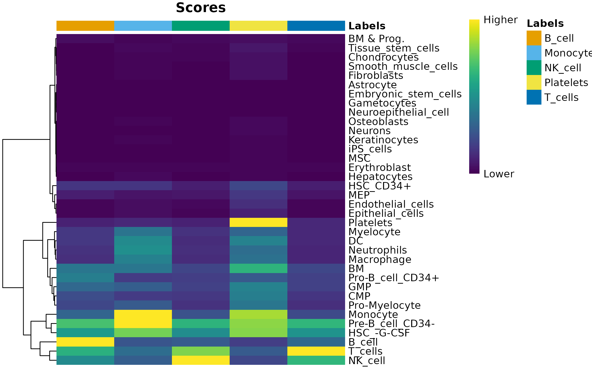

[流程示例一](https://djhcod.github.io/r-notes/single_cell/sc_supplementary/DecontX.html)


## 01 数据

同Spatial练习，或[Scanpy笔记(pbcm3k)](https://jiarong-l.github.io/notes/Bioinfo/Blocks/Scanpy/)

```bash
pbmc3k
├── barcodes.tsv
├── genes.tsv
└── matrix.mtx
```


## 02 预处理

以下操作之后（之前），还需进行基本处理：Filtering(MT/..) + SCTransform() + PCA/Clustering + 批次合并(Spatial_04a/b) + 细胞周期

建议综合考虑多个软件的结果（此练习只是单纯的分别运行代码、没有投票整合），不过也可以只用SOTA方法

### a. 去除Doublet
* 说明：（UMI异常高的细胞），但需要注意（免疫细胞+组织细胞）的情况
* 工具：Scrublet(Py), DoubletFinder(R), scDblFinder(R)

查看Doublet的分布，随后从数据中将它们去除 


其中采用 Doublet Simulation 的方法，对于相同细胞类型构成的 Doublet 不敏感 --- 可能因为聚类时会聚到一起，影响了 Score 的计算？？

### b. Imputation进行降噪  
* 说明：（对抗 Dropout event），当基因表达量过低时候（正常情况中位数约1500）
* 工具：[SAVER/SAVERX](https://singlecell.wharton.upenn.edu/saver-x/)，[MAGIC](https://cloud.tencent.com/developer/article/1803724)，scImpute，...
* 原理：基因并不是单独存在的，表达通路使它们关联，或可依据高表达量者推断其它基因的表达

预训练一个模型进行数据恢复（贝叶斯/Markov/AE/...），一般同时也具有降噪效果（但很难说模型会不会引入bias）

### c. 去除Contamination
* 说明：（破碎细胞的基因飘入液滴），当UMI曲线末段下降幅度不够陡峭时，当聚类图像显得有些模糊毛躁时
* 工具： [SoupX](https://github.com/constantAmateur/SoupX)）/ [DecontX](https://bioc.r-universe.dev/decontX/doc/manual.html)
* 原理：利用背景游离的RNA（需要空液滴数据）/ 使用Beyesian模型，随后从捕获的细胞数据中去除污染部分


## 03 细胞注释

自动化的SingleR注释并不一定准确，可以手动注释、使用各种DL工具

[Score_of_Celltype_i = 交集(Input_Marker,DB_CellMarker) / 并集(Input_Marker,DB_CellMarker)](https://blog.csdn.net/m0_72224305/article/details/127921124)





## 04 细胞轨迹

定义细胞类型后（且需要自定义初始状态的细胞），选定xx功能相关的基因（生物学背景/HVG/PAGA-DiffusionMap），构建xx功能相关的细胞轨迹（即 branching tree），绘制相关基因在轨迹上的表达


绘制时可用热图，而点图graph的layout似乎也只需要关心其init位置？


## 05 细胞通讯


## 06 其它

### CNV

### TF


## 环境

Conda中：R version 4.4.1

```bash
# chooseCRANmirror(graphics=F)
# chooseBioCmirror(graphics=F)

conda activate scenv
conda install R -y
conda install r-base -y
conda install r-essentials -y 
conda install r-seurat -y
conda install conda-forge::r-ggplot2 -y

sudo apt-get install libgit2-dev
conda install libgit2 -y
conda install r-devtools -y
# install.packages("BiocManager")


# BiocManager::install("SingleCellExperiment")    ## Don't update curl !!
# BiocManager::install("ComplexHeatmap")


conda install r-hdf5r -y
# install.packages("remotes")
# remotes::install_github("mojaveazure/seurat-disk")


# devtools::install_github('chris-mcginnis-ucsf/DoubletFinder')
# BiocManager::install('glmGamPoi')


# BiocManager::install("scDblFinder") 


conda install r-circlize -y
conda install r-enrichr -y
# BiocManager::install("celda")
conda install r-rstan
# devtools::install_github("campbio/decontX")


# options(timeout=10000)
# install.packages('SoupX')


# BiocManager::install("SingleR")
conda install r-v8
# BiocManager::install("celldex")


```


其它
```R
> packageVersion(c("Seurat"))
[1] ‘5.1.0’

> BiocManager::version()
[1] ‘3.20’


## 每次加装新包之后matrixStats就有error，需降低版本，否则SCT出错
## wget https://cran.r-project.org/src/contrib/Archive/matrixStats/matrixStats_1.1.0.tar.gz
install.packages("matrixStats_1.1.0.tar.gz",repos=NULL) 
```


