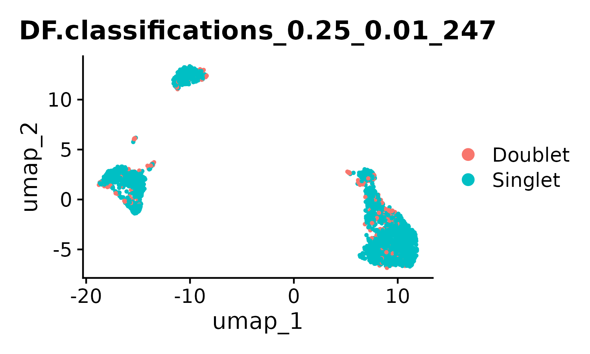

```R
> packageVersion(c("Seurat"))
[1] ‘5.1.0’

## 根据SCT的提示安装了一个什么包，之后matrixStats就有error需降低版本
## wget https://cran.r-project.org/src/contrib/Archive/matrixStats/matrixStats_1.1.0.tar.gz
install.packages("matrixStats_1.1.0.tar.gz",repos=NULL) 
```

## 01 数据

同Spatial练习，或[Scanpy笔记(pbcm3k)](https://jiarong-l.github.io/notes/Bioinfo/Blocks/Scanpy/)

```bash
pbmc3k
├── barcodes.tsv
├── genes.tsv
└── matrix.mtx
```


## 02 预处理

开始前，先进行基本处理：Filtering(MT/..) + SCTransform() + PCA/Clustering + 批次合并(Spatial_04a/b) + 细胞周期

建议综合考虑多个软件的结果（此练习只是单纯的分别运行代码、没有投票整合），不过也可以只用SOTA方法

a. 去除Doublet（UMI异常高的细胞），但需要注意（免疫细胞+组织细胞）的情况    
    - Scrublet(Py), DoubletFinder(R), scDblFinder(R)
b. Imputation进行降噪    
c. 去除Contamination（破碎细胞飘入液滴）    





