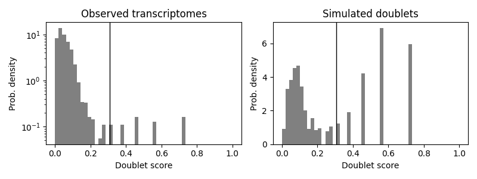

## Scrublet

模拟生成doublets，基于模拟数据，选取可区分singlets与doublets的阈值，参考：https://www.jianshu.com/p/fe69105cb3eb

由于过程中包含了SCT与PCA，因此直接读取原始matrix即可


## Py

```py
import scanpy as sc
import scrublet
import loompy
import scipy
import matplotlib.pyplot as plt
import numpy as np


## init
counts_matrix = scipy.io.mmread('tmp/pbmc3k/matrix.mtx').T.tocsc()
scrub = scrublet.Scrublet(counts_matrix, expected_doublet_rate=0.06)


## simulate, SCT+PCA, Doublet score ==> Auto predicted doublets
doublet_scores, predicted_doublets = scrub.scrub_doublets(min_counts=2, min_cells=3, min_gene_variability_pctl=85, n_prin_comps=30)

## Plot Doublet Score of (simulated + orginal) dataset
## A nice threshold should separate the 2 peaks of simulated & original data
scrub.plot_histogram()
plt.savefig('img/02a_3.png')

## if unhappy about the Auto score threshold, reset it to 0.25 according to the Plot
## or just:   doublet_scores > 0.25
refined_predicted_doublets = scrub.call_doublets(threshold=0.25)

## Then you can remove the cell from your counts_matrix / AnnData ！！！！
```




## Err
### 输入问题
如果读取的数据已经SCT过，可能会因为负数出现问题，如下例：
```py
## 此前的R操作见同目录下‘02__AnnData.ipynb’
adata = sc.read_loom('tmp/pbmc3k.loom', sparse=True, cleanup=False)
scrub = scrublet.Scrublet(adata.X, expected_doublet_rate=0.06)
```

### Jupyter问题
Kernel自动重启，怀疑是内存设置不够，但事实上也没用很多内存// 

失败：（Linux也许有效，win/wsl无resource）：https://dnmtechs.com/increasing-jupyter-notebook-memory-limit-in-python-3/ 
```
import os
os.environ['KMP_DUPLICATE_LIB_OK']='TRUE'
import resource                                                  ## Linux Only
resource.setrlimit(resource.RLIMIT_AS, (2147483648, 2147483648)) ## 2GB limit
```
失败：jupyter notebook --NotebookApp.max_buffer_size=21474836480

未尝试：https://discourse.jupyter.org/t/increase-ram-for-jupyter-notebook/20687